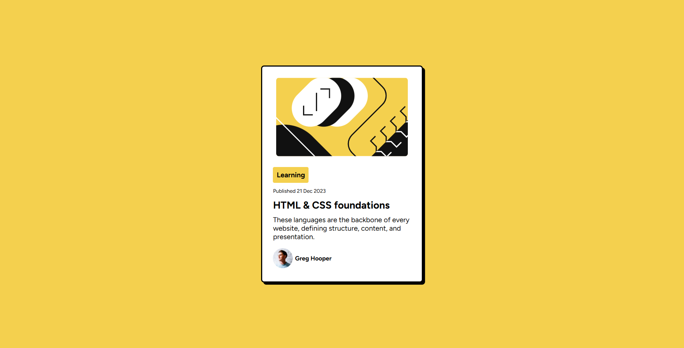
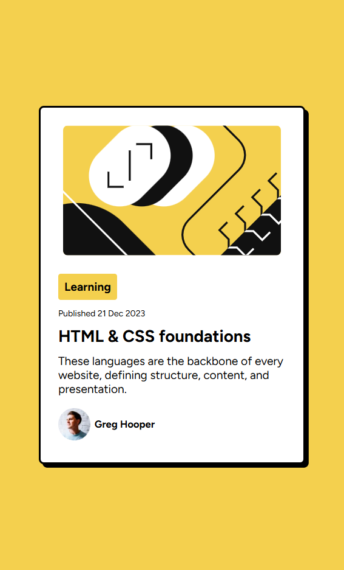

# Frontend Mentor - Blog preview card solution

## Table of contents

- [Overview](#overview)
  - [The challenge](#the-challenge)
  - [Screenshot](#screenshot)
  - [Links](#links)
- [My process](#my-process)
  - [Built with](#built-with)
  - [What I learned](#what-i-learned)
- [Author](#author)
- [Acknowledgments](#acknowledgments)

**Note: Delete this note and update the table of contents based on what sections you keep.**

## Overview

### The challenge

Users should be able to:

- See hover and focus states for all interactive elements on the page

### Screenshot

This is the desktop version.



This is the mobile version.



### Links

- Live Site URL: [live site URL](https://notfaraway.github.io/blog-preview-card-main/)

## My process

### Built with

- Semantic HTML5 markup
- CSS custom properties
- Flexbox
- Mobile-first workflow
- CSS Media Queries

### What I learned

- Learning to center a box with the following html coding.

```html
body { display: flex; align-items: center; justify-content: center; height:
100vh; background-color: hsl(47, 88%, 63%); }
```

- Learning to add shadow to a box with `box-shadow: 7px 7px;`

- Learning to put an image next to the text with the CSS coding below:

```css
.author-photo {
  display: inline;
  vertical-align: middle;
}
.author-name {
  display: inline;
  vertical-align: middle;
}
```

## Author

- Frontend Mentor - [@notfaraway](https://www.frontendmentor.io/profile/notfaraway)

## Acknowledgments

Thanks to Frontend Mentor!
